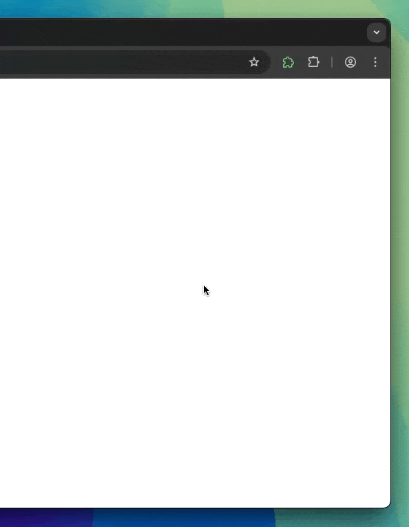

# Sidepanel Extension Template

A modern browser extension template with sidepanel support, built with WXT + Tailwind CSS 4.0 + shadcn/ui.

## Features

- 🖥️ **Sidepanel Interface** - Click extension icon to open browser sidepanel
- ⚡ **WXT Framework** - Next-generation Web Extension development framework
- ⚛️ **React** - Modern UI framework with TypeScript support
- 🎨 **Tailwind CSS 4.0** - Latest utility-first CSS framework
- 🛠️ **shadcn/ui Ready** - Pre-configured for beautiful, accessible React components
- 🌙 **Theme Management** - System/Light/Dark theme support
- 💾 **Local Storage** - Persistent data storage with WXT Storage API
- ⚙️ **Runtime Configuration** - Built-in runtime config system with type safety
- 🔧 **TypeScript** - Full type safety and developer experience
- 🎯 **Modern Development** - Hot reload, modern build tools

## Demo



*Watch how the sidepanel extension works: click the extension icon to open the sidepanel interface.*

## Getting Started

### Prerequisites

- Node.js 18+
- pnpm (recommended) or npm

### Installation

1. **Clone or use this template**
   ```bash
   git clone <repository-url>
   cd sidepanel-extension-template
   ```

2. **Install dependencies**
   ```bash
   pnpm install
   ```

3. **Start development**
   ```bash
   pnpm dev
   ```

4. **Load extension in browser**
   - Open `chrome://extensions/`
   - Enable "Developer mode"
   - Click "Load unpacked extension"
   - Select the `.output/chrome-mv3` folder

### Usage

1. Click the extension icon in the browser toolbar
2. The sidepanel will open on the right side
3. Start customizing the template for your needs

## Project Structure

```
sidepanel-extension-template/
├── entrypoints/           # Extension entry points
│   ├── background.ts      # Background script
│   ├── content.ts         # Content script (optional)
│   └── sidepanel/         # Sidepanel UI
│       ├── App.tsx        # Main React app
│       ├── index.html     # HTML template
│       └── main.tsx       # React entry point
├── components/            # React components
│   └── ui/                # shadcn/ui components
├── lib/                   # Utility functions
│   └── utils.ts           # Common utilities
├── hooks/                 # Custom React hooks
│   ├── use-theme.ts       # Theme management hook
│   └── use-settings.ts    # Settings storage hook
├── assets/                # Static assets
├── public/                # Public assets (icons, etc.)
├── app.config.ts          # Runtime configuration
├── components.json        # shadcn/ui configuration
├── wxt.config.ts          # WXT configuration
└── package.json           # Dependencies and scripts
```

## Adding shadcn/ui Components

This template is pre-configured for shadcn/ui. To add components:

```bash
# Example: Add a button component
pnpm dlx shadcn@latest add button

# Example: Add a dialog component
pnpm dlx shadcn@latest add dialog
```

The components will be automatically added to `components/ui/` with proper styling.

## Development Commands

```bash
# Development mode with hot reload (Chrome by default)
pnpm dev

# Development for specific browsers
pnpm dev:chrome
pnpm dev:firefox
pnpm dev:edge
pnpm dev:safari

# Build for production (Chrome by default)
pnpm build

# Build for specific browsers
pnpm build:chrome
pnpm build:firefox
pnpm build:edge
pnpm build:safari

# Create extension zip files
pnpm zip
pnpm zip:chrome
pnpm zip:firefox
pnpm zip:edge
pnpm zip:safari

# Type checking
pnpm compile
```

## Customization

### Styling

- Edit `assets/tailwind.css` for global styles
- Modify theme colors in `components.json`
- Tailwind CSS 4.0 configuration in `wxt.config.ts`

### Extension Configuration

- Update manifest permissions in `wxt.config.ts`
- Modify extension metadata in `package.json`
- Change icons in `public/icon/`

### Sidepanel Content

- Edit `entrypoints/sidepanel/App.tsx` for main UI
- Add new routes/pages as needed
- Extend with additional React components

## Browser Support

This extension supports all major browsers through WXT's universal browser compatibility:

- ✅ **Chrome** (Manifest V3) - `pnpm dev:chrome`, `pnpm build:chrome`
- ✅ **Firefox** (Manifest V2) - `pnpm dev:firefox`, `pnpm build:firefox`
- ✅ **Edge** (Manifest V3) - `pnpm dev:edge`, `pnpm build:edge`
- ✅ **Safari** (Manifest V2) - `pnpm dev:safari`, `pnpm build:safari`
- ✅ **Other Chromium-based browsers** (Opera, Brave, etc.)

## License

MIT License - feel free to use this template for your projects!

## Contributing

1. Fork the repository
2. Create a feature branch
3. Make your changes
4. Submit a pull request

---

Built with ❤️ using [WXT](https://wxt.dev), [Tailwind CSS](https://tailwindcss.com), and [shadcn/ui](https://ui.shadcn.com)
